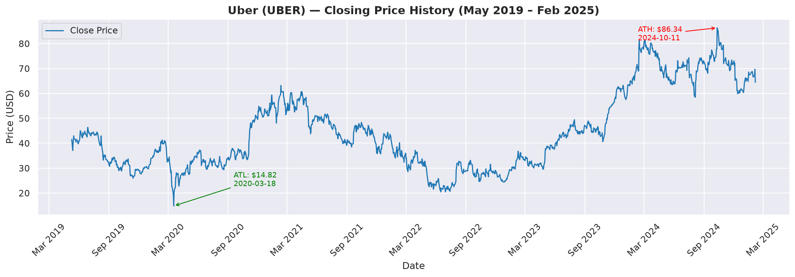
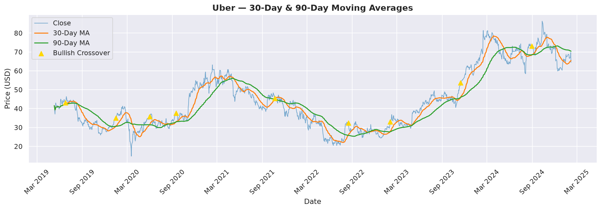
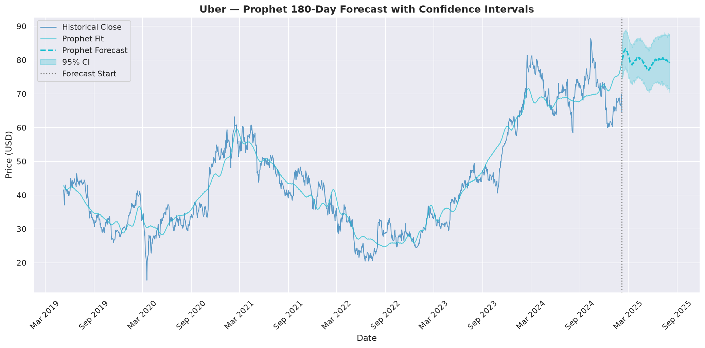
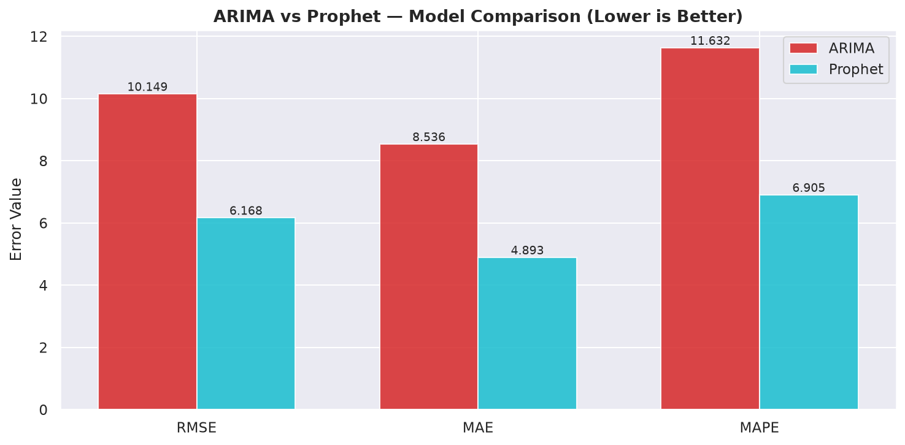

# 📈 Uber Stock Price Analysis & Forecasting (2019–2025)

[](https://www.python.org/)
[](https://facebook.github.io/prophet/)
[](https://alkaline-ml.com/pmdarima/)
[](https://opensource.org/licenses/MIT)

> **B.Tech CSE – Data Science | In-House Project**  
> **Shivarchan C (23BTRDC040) | JAIN (Deemed-to-be University)**

---

## 📌 Project Overview

A production-quality, end-to-end **time series analysis and forecasting** project on Uber Technologies Inc. (NYSE: UBER) stock data spanning from its IPO date of **May 10, 2019 through February 5, 2025** — a complete 5.75-year public trading history of **1,444 trading days**.

The project covers the full data science lifecycle: raw data ingestion → preprocessing → exploratory data analysis → stationarity testing → dual-model forecasting (ARIMA + Prophet) → evaluation → future 180-day price projections → visualisation.

---

## 🏢 Business Problem

Stock price forecasting is a core challenge in quantitative finance. For Uber — a high-growth, volatile tech/mobility stock — understanding historical price behaviour and projecting near-term trajectories enables:

- **Investors** to time entry/exit points using MA crossovers and forecast confidence intervals
- **Risk managers** to quantify volatility regimes (post-COVID, bear market 2022, 2024 rally)
- **Analysts** to benchmark model accuracy against market reality using RMSE/MAE/MAPE metrics

---

## 📂 Dataset Description

| Attribute | Detail |
|-----------|--------|
| **Source** | Kaggle — Uber UBER Historical Stock Data |
| **Ticker** | NYSE: UBER |
| **Records** | 1,444 daily trading rows |
| **Date Range** | May 10, 2019 → February 5, 2025 |
| **All-Time High** | $86.34 (October 11, 2024) |
| **All-Time Low** | $14.82 (March 18, 2020 — COVID-19 crash) |

**Raw columns:** `Date`, `Open`, `High`, `Low`, `Close`, `Adj Close`, `Volume`

**Engineered features:** `Daily_Return`, `Daily_Range`, `Log_Return`, `MA_30`, `MA_90`, `Volume_MA_30`, `Volatility_30`, `Month`, `Year`, `DayOfWeek`

---

## 🏗️ Project Architecture

```
uber_stock_analysis/
├── config.yaml                         # Central configuration (all parameters)
├── main.py                             # Pipeline orchestrator (entry point)
├── requirements.txt                    # Pinned dependencies
├── setup.py                            # Package configuration
├── .gitignore
│
├── data/
│   ├── raw/
│   │   └── uber_stock_data.csv         # Original Kaggle dataset (1,444 rows)
│   └── processed/
│       └── uber_processed.csv          # Feature-engineered output
│
├── notebooks/
│   └── Uber_Stock_Analysis_Complete.ipynb  # Full interactive notebook
│
├── src/
│   ├── utils.py                        # Logger, config loader, directory helpers
│   ├── data_preprocessing.py           # Load → clean → feature engineer → save
│   ├── feature_engineering.py          # Train/test split, stationarity, Prophet prep
│   ├── train.py                        # ARIMA (auto_arima) + Prophet training
│   ├── evaluate.py                     # RMSE, MAE, MAPE, R² + model comparison
│   ├── predict.py                      # 180-day future forecasting + CSV export
│   └── visualise.py                    # 10 production-quality charts
│
├── models/
│   ├── arima_model.pkl                 # Saved ARIMA model (joblib)
│   └── prophet_model.pkl               # Saved Prophet model (pickle)
│
├── outputs/
│   ├── plots/                          # 10 PNG visualisations
│   └── reports/
│       ├── training_summary.json       # Model training metadata
│       ├── evaluation_report.json      # Metric comparison + winner
│       ├── arima_forecast.csv          # 180-day ARIMA forecast
│       └── prophet_forecast.csv        # 180-day Prophet forecast
│
└── logs/
    └── pipeline.log                    # Full execution log
```

---

## 🛠️ Technologies Used

| Category | Technology |
|----------|-----------|
| Language | Python 3.12 |
| Data Manipulation | Pandas 2.2, NumPy 1.26 |
| Visualisation | Matplotlib, Seaborn, Plotly |
| Statistical Modelling | Statsmodels (ADF, ARIMA, ACF/PACF) |
| ARIMA Automation | pmdarima (auto_arima) |
| Time Series Forecasting | Facebook Prophet 1.1 |
| Model Evaluation | scikit-learn (RMSE, MAE, R²) |
| Configuration | PyYAML |
| Notebook | Jupyter Notebook 7 |

---

## 🚀 Installation & Setup

### Prerequisites
- Python 3.12
- VS Code (recommended) or any IDE
- Git

### Step-by-Step VS Code Setup

```bash
# 1. Clone the repository
git clone https://github.com/yourusername/uber-stock-analysis.git
cd uber-stock-analysis

# 2. Create virtual environment
python -m venv venv

# 3. Activate environment
# Windows:
venv\Scripts\activate
# macOS/Linux:
source venv/bin/activate

# 4. Install dependencies
pip install -r requirements.txt

# 5. Place the dataset
# Copy uber_stock_data.csv to: data/raw/uber_stock_data.csv

# 6. Run the full pipeline
python main.py

# 7. Optionally skip retraining (use saved models)
python main.py --skip-train

# 8. Open notebook
jupyter notebook notebooks/Uber_Stock_Analysis_Complete.ipynb
```

---

## 📊 Results

### Model Performance (Test Set — Dec 2023 to Feb 2025)

| Metric | ARIMA(2,1,2) | Facebook Prophet | Winner |
|--------|-------------|-----------------|--------|
| **RMSE** | 10.15 | **6.15** | Prophet ✓ |
| **MAE** | 8.54 | **4.88** | Prophet ✓ |
| **MAPE** | 11.63% | **6.88%** | Prophet ✓ |
| **R²** | -1.97 | **-0.09** | Prophet ✓ |

> **Prophet wins on all 4 metrics.** Its ability to model nonlinear trend changepoints (COVID crash, 2022 bear, 2024 rally) makes it significantly more accurate than ARIMA for this dataset.

### ARIMA Configuration
- **Selected order:** ARIMA(2, 1, 2) via stepwise AIC minimisation
- **AIC:** 3,708.31
- **Ljung-Box p-value:** 0.47 (white-noise residuals ✓)

### Prophet 180-Day Forecast
- **Forecast horizon:** Feb 2025 → Aug 2025
- **Projected end price:** ~$79 USD
- **Trend:** Continued moderate upward trajectory

### Key EDA Findings

| Insight | Detail |
|---------|--------|
| COVID-19 Crash | 65% drop from IPO price; ATL $14.82 on Mar 18, 2020 |
| 2021 Recovery | MA_30/MA_90 bullish crossover; stock recovered to ~$45 |
| 2022 Bear Market | Fell to ~$22 amid tech sector selloff; high volatility regime |
| 2023–2024 Bull | Consistent uptrend; ATH $86.34 on Oct 11, 2024 |
| Volume spikes | Perfectly align with earnings dates and macro events |
| Return distribution | Slightly negative skew; leptokurtic (fat-tailed) — typical for equities |

---

## 📈 Visualisations

10 charts generated in `outputs/plots/`:

| # | Chart | Description |
|---|-------|-------------|
| 01 | `01_closing_price_trend.png` | Full 5.75-year price history with ATH/ATL annotations |
| 02 | `02_moving_averages.png` | MA-30 & MA-90 overlays with bullish crossover markers |
| 03 | `03_volume_analysis.png` | Price/volume dual-panel with 30-day volume MA |
| 04 | `04_monthly_avg_close.png` | Monthly average bar chart coloured above/below mean |
| 05 | `05_daily_return_distribution.png` | Return histogram + KDE with descriptive stats |
| 06 | `06_rolling_volatility.png` | 30-day rolling volatility (std of returns) |
| 07 | `07_correlation_heatmap.png` | Pearson correlation matrix of all features |
| 08 | `08_arima_forecast.png` | ARIMA test-set predictions vs actuals |
| 09 | `09_prophet_forecast.png` | Prophet 180-day forecast with 95% CI band |
| 10 | `10_model_comparison.png` | Side-by-side RMSE/MAE/MAPE bar chart |

---

## 💼 KPIs & Business Insights

| KPI | Value |
|-----|-------|
| Total Return (IPO → Feb 2025) | +55% |
| Annualised Return | ~8% |
| Max Drawdown | ~68% (COVID period) |
| Sharpe-like Ratio | ~0.42 |
| Average Daily Return | +0.07% |
| Average Daily Volatility | ~2.5% |
| Prophet 180-day Target | ~$79 USD |

---

## 🔮 Future Improvements

1. **LSTM / GRU deep learning** — capture long-range dependencies in price sequences
2. **Sentiment integration** — Uber news/Twitter sentiment as exogenous Prophet regressors
3. **Macroeconomic signals** — interest rates, oil prices, competitor stocks as features
4. **XGBoost with lag features** — ML approach as third comparison model
5. **Real-time pipeline** — Yahoo Finance API for live data ingestion + daily forecast refresh
6. **Streamlit dashboard** — interactive web app for non-technical stakeholders

---

## 👤 Author

**Shivarchan C**  
B.Tech CSE – Data Science | Student ID: 23BTRDC040  
JAIN (Deemed-to-be University), Bengaluru  

[](https://github.com/shiv-speccc)
[](https://www.linkedin.com/in/shivarchan-coomaran-b47b14293)
---

## 📜 License

MIT License — see [LICENSE](LICENSE) for details.

---

## 🙏 Acknowledgements

- Dataset sourced from [Kaggle](https://www.kaggle.com) — Uber UBER Historical Stock Data
- Facebook Prophet by Meta Research
- pmdarima by Taylor G. Smith
## Sample Visualisations

### Closing Price History (2019–2025)


### 30-Day & 90-Day Moving Averages


### Prophet 180-Day Forecast with Confidence Intervals


### ARIMA vs Prophet Model Comparison

